  

I build fast, well-crafted web products end to end — from interface design through to the systems behind them.

 

### WORK

**[ngonlenin](https://ngonlenin.id/)** — Full-stack Engineer & Finance, 2026–present
Commerce platform for Indonesian small businesses: shareable storefront, QR ordering, live cashier/kitchen queues.
`Next.js` `Postgres` `Realtime` `Payments`

**[Mulfu](https://mulfu.co/)** — Full-stack Engineer & DevOps, 2026–present
Plagiarism/AI-detection service for Indonesian students, with paraphrasing and document repair.
`Next.js` `Bun` `Kubernetes` `Terraform`

**[Tako](https://tako.id/)** — Full-stack Engineer, 2023–present
Creator gifting platform for Indonesian streamers — 10,000+ users, 2,500+ creators.
`Next.js` `Postgres` `Realtime` `Payments`

### PROJECTS

- **[Ryu](https://ryu.rin.ci/)** — spending tracker, web + desktop · `TanStack` `Tauri` `Cloudflare`
- **[Rinci](https://link.rin.ci/)** — short links, custom domains, click analytics · `Astro` `React`
- **[Almach](https://almach.kita.blue/)** — accessible React component library, 30+ components · `React Aria` `Tailwind v4` `TanStack`
- **[Events Platform](https://events.kita.blue/)** — multi-tenant ticketing & event management · `Next.js`
- **[NFCC](https://nfcc.my.id/)** — offensive security workshops & CTF site for Nurul Fikri Cybersecurity Community

### STACK

### GITHUB

 

<picture>
  <source media="(prefers-color-scheme: dark)" srcset="https://raw.githubusercontent.com/rafaalrazzak/rafaalrazzak/output/github-contribution-grid-snake-dark.svg" />
  
</picture>

---

Full portfolio at <a href="https://rafaar.com">rafaar.com</a>
